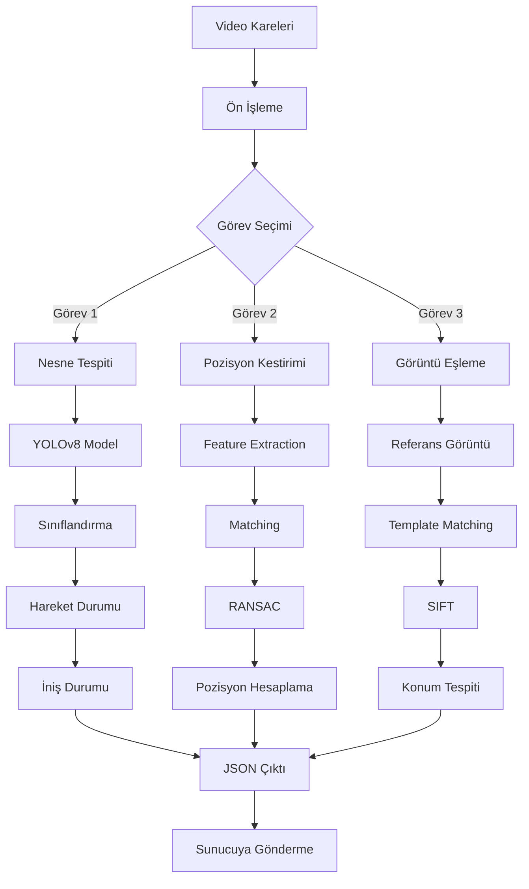

# TEKNOFEST 2026 - HAVACILIKTA YAPAY ZEKA YARIŞMASI
## EYLEM PLANI VE ÖĞRENME YOL HARİTASI

---

## 📋 GENEL BAKIŞ

Bu doküman, TEKNOFEST 2026 Havacılıkta Yapay Zeka Yarışması için gerekli olan tüm çalışmaları, öğrenme konularını ve rapor hazırlama sürecini detaylı olarak planlamaktadır.

---

## 🎯 YARIŞMANIN 3 GÖREVİ

### 1. BİRİNCİ GÖREV: NESNE TESPİTİ (%25 Puan)

**Amaç:** Hava aracı alt-görüş kamerası görüntülerinden nesneleri tespit etmek

**Tespit Edilecek Nesneler:**
| Sınıf | ID | Açıklama | Hareket Durumu | İniş Durumu |
|-------|-------|---------|----------------|-------------|
| Taşıt | 0 | Tüm kara, deniz, raylı taşıtlar | 0:Hareketsiz, 1:Hareketli | -1 |
| İnsan | 1 | Tüm insanlar | -1 | -1 |
| UAP Alanı | 2 | Uçan Araba Park alanı (4.5m çapında daire) | -1 | 0:Uygun değil, 1:Uygun |
| UAİ Alanı | 3 | Uçan Ambulans İniş alanı (4.5m çapında daire) | -1 | 0:Uygun değil, 1:Uygun |

**Puanlama:** mAP (mean Average Precision), IoU eşik değeri: 0.5

**Teknik Gereksinimler:**
- Video: 5 dakika, 7.5 FPS, 2250 kare
- Çözünürlük: Full HD veya 4K
- Kamera açısı: 70-90 derece
- RGB veya Termal görüntüler

### 2. İKİNCİ GÖREV: POZİSYON TESPİTİ (%40 Puan)

**Amaç:** GPS devre dışı olduğunda görsel verilerden pozisyon kestirimi

**Çıktı:**
- X ekseninde metre cinsinden değişim (video başlangıcına göre)
- Y ekseninde metre cinsinden değişim (video başlangıcına göre)
- Z ekseninde metre cinsinden değişim (video başlangıcına göre)

**Puanlama:** Ortalama hata formülü ile hesaplama
```
E = (1/N) × Σ√((x̂ᵢ - xᵢ)² + (ŷᵢ - yᵢ)² + (ẑᵢ - zᵢ)²)
```

**Sağlık Durumu:**
- İlk 1 dakika (450 kare): Sağlıklı (GPS çalışıyor)
- Son 4 dakika (1800 kare): Sağlıksız olabilir (GPS çalışmıyor)

### 3. ÜÇÜNCÜ GÖREV: GÖRÜNTÜ EŞLEME (%25 Puan)

**Amaç:** Önceden tanımlanmamış nesneleri görüntüden tespit etmek

**Zorluklar:**
- Farklı kameralar (Termal → RGB eşleştirme)
- Farklı açılar ve irtifalar
- Uydu görüntüleri → Yer görüntüleri eşleştirme
- Görüntü işleme işleminden geçmiş görüntüler

**Puanlama:** mAP metriği

---

## 📚 ÖĞRENME YOL HARİTASI

### A. ZORUNLU TEMEL BİLGİLER

#### 1. Python Programlama
- [ ] Python temel sözdizimi
- [ ] Veri yapıları (list, dict, tuple, set)
- [ ] Fonksiyonlar ve modüller
- [ ] Nesne yönelimli programlama
- [ ] Dosya işlemleri

**Kaynaklar:**
- Python官方文档
- Real Python
- YouTube Python eğitimleri (Türkçe)

#### 2. Matematik ve İstatistik

**Lineer Cebir:**
- [ ] Matris işlemleri
- [ ] Vektörler ve vektör uzayları
- [ ] Özdeğer ve özvektör
- [ ] Matris çarpımı ve tersi

**Olasılık ve İstatistik:**
- [ ] Olasılık dağılımları
- [ ] Bayes teoremi
- [ ] Hipotez testleri
- [ ] Regresyon analizi

**Kalkülüs:**
- [ ] Türev ve integral
- [ ] Zincir kuralı
- [ ] Gradyan inişi
- [ ] Kısmi türevler

#### 3. Görüntü İşleme Temelleri

**OpenCV:**
- [ ] Görüntü okuma/yazma
- [ ] Renk uzayları (RGB, HSV, Grayscale)
- [ ] Filtreler ve convolutions
- [ ] Kenar tespiti (Canny, Sobel)
- [ ] Feature detection (SIFT, ORB)
- [ ] Görüntü eşleştirme teknikleri

**Temel Kavramlar:**
- [ ] Piksel manipülasyonu
- [ ] Gürültü giderme
- [ ] Morphological operations
- [ ] Histogram equalization

### B. MAKİNE ÖĞRENMESİ

#### 1. Temel Kavramlar
- [ ] supervised vs unsupervised learning
- [ ] Classification vs Regression
- [ ] Overfitting vs Underfitting
- [ ] Bias-Variance tradeoff
- [ ] Cross-validation
- [ ] Regularization (L1, L2)

#### 2. Derin Öğrenme (Deep Learning)

**Frameworkler:**
- [ ] PyTorch (önerilen)
- [ ] TensorFlow/Keras

**Temel Konular:**
- [ ] Neural Networks temelleri
- [ ] Activation functions (ReLU, Sigmoid, Softmax)
- [ ] Loss functions (MSE, Cross-Entropy)
- [ ] Optimization (SGD, Adam, RMSprop)
- [ ] Backpropagation

### C. NESNE TESPİTİ (OBJECT DETECTION)

#### 1. Temel Algoritmalar
- [ ] **YOLO (You Only Look Once)**
  - YOLOv5, YOLOv8, YOLOv10
  - Anchor-based vs Anchor-free
  - Non-Maximum Suppression (NMS)

- [ ] **Two-Stage Detectors**
  - Faster R-CNN
  - Region Proposal Networks

- [ ] **Transformer-based**
  - DETR (Detection Transformer)
  - Deformable DETR

#### 2. Eğitim Teknikleri
- [ ] Data Augmentation
  - Rotation, flip, scale
  - Color jittering
  - Mosaic augmentation
  - Mixup, Cutmix

- [ ] Transfer Learning
  - Pre-trained weights
  - Fine-tuning strategies
  - Layer freezing

- [ ] Hyperparameter Tuning
  - Learning rate scheduling
  - Batch size optimization
  - Weight decay

#### 3. Değerlendirme Metrikleri
- [ ] **IoU (Intersection over Union)**
  - Formül: `IoU = (A ∩ B) / (A ∪ B)`
  - Eşik değeri: 0.5

- [ ] **mAP (mean Average Precision)**
  - Precision-Recall curve
  - AP hesaplama
  - mAP@0.5

- [ ] Confusion Matrix
- [ ] F1-Score

### D. POZİSYON KESTİRİMİ (POSITION ESTIMATION)

#### 1. Görsel Odometri (Visual Odometry)
- [ ] Feature matching
- [ ] Optical flow
- [ ] Structure from Motion (SfM)
- [ ] Bundle adjustment

#### 2. Teknikler
- [ ] **Feature-based Methods**
  - SIFT, SURF, ORB
  - Feature matching
  - RANSAC

- [ ] **Deep Learning Methods**
  - End-to-end learning
  - CNN-based odometry
  - Transformer approaches

- [ ] **Sensor Fusion**
  - IMU + Camera
  - GPS + Vision
  - Kalman filtering

#### 3. Koordinat Sistemleri
- [ ] World coordinates
- [ ] Camera coordinates
- [ ] Coordinate transformations
- [ ] Homography

### E. GÖRÜNTÜ EŞLEME (IMAGE MATCHING)

#### 1. Feature Matching
- [ ] Keypoint detection
- [ ] Descriptor extraction
- [ ] Feature matching (BF Matcher, FLANN)
- [ ] Outlier rejection (RANSAC)

#### 2. Template Matching
- [ ] OpenCV template matching
- [ ] Multi-scale matching
- [ ] Rotation invariant matching

#### 3. Deep Learning Approaches
- [ ] Siamese Networks
- [ ] Contrastive learning
- [ ] Metric learning
- [ ] Vision Transformers

---

## 🛠️ TEKNİK ALTYAPI HAZIRLAMA

### 1. Donanım Gereksinimleri
- [ ] GPU (NVIDIA, en az 8GB VRAM)
- [ ] RAM (en az 16GB)
- [ ] Depolama (en az 500GB SSD)
- [ ] Ethernet bağlantı noktası

### 2. Yazılım Kurulumu

**Python Ortamı:**
```bash
# Conda ortamı oluştur
conda create -n teknofest_ai python=3.10
conda activate teknofest_ai

# Temel paketler
pip install torch torchvision torchaudio --index-url https://download.pytorch.org/whl/cu118
pip install opencv-python
pip install numpy pandas matplotlib
pip install scikit-learn
pip albumentations
```

**Nesne Tespiti için:**
```bash
# YOLOv8
pip install ultralytics

# veya YOLOv5
git clone https://github.com/ultralytics/yolov5
cd yolov5
pip install -r requirements.txt
```

**Görüntü İşleme için:**
```bash
pip install opencv-contrib-python  # SIFT/ORB için
pip install imagehash
pip install imgaug
```

### 3. Veri Seti Hazırlama

**Gerekli Veri Setleri:**
- [ ] COCO Dataset (pre-training için)
- [ ] DOTA Dataset (aerial görüntüler için)
- [ ] VisDrone (drone görüntüleri için)
- [ ] Öz veri seti (ETKİNOFEST örnek verileri)

**Veri Seti Formatı (YOLO):**
```
dataset/
├── images/
│   ├── train/
│   ├── val/
│   └── test/
├── labels/
│   ├── train/
│   ├── val/
│   └── test/
└── data.yaml
```

**data.yaml örneği:**
```yaml
path: ../dataset
train: images/train
val: images/val
test: images/test

nc: 4  # 4 sınıf
names: ['tasi', 'insan', 'uap', 'uai']
```

---

## 📝 ÖN TASARIM RAPORU DOLDURMA REHBERİ

### Bölüm 1: TAKIM ŞEMASI (Zorunlu)

**Doldurulacak Bilgiler:**
- Takım üyelerinin görev dağılımı
- Kişisel isim YAZILMAYACAK (Üye 1, Üye 2, vb.)

**Örnek:**
```
Kaptan (Üye 1): Proje koordinasyonu
İletişim Sorumlusu (Üye 2): Sunumlar
Algoritma Geliştirici (Üye 3): Model eğitimi
Veri Mühendisi (Üye 4): Etiketleme, ön işleme
Donanım Sorumlusu (Üye 5): Sistem kurulumu
```

### Bölüm 2: PROJE MEVCUT DURUM DEĞERLENDİRMESİ (10 Puan)

**Yazılacak İçerikler:**
1. Projenin amacı ve hedefleri
2. Şu ana kadar yapılan çalışmalar
3. Ekip yetkinlikleri
4. Kullanılan teknolojiler
5. Mevcut durum analizi

**Örnek İçerik:**
```markdown
## Proje Mevcut Durum Değerlendirmesi

### Projenin Amacı
TEKNOFEST 2026 Havacılıkta Yapay Zeka Yarışması kapsamında, 
hava araçlarının alt-görüş kamerası görüntülerinden:

1. Taşıt, insan, UAP ve UAİ alanlarını tespit etmek
2. Hava aracının pozisyonunu görsel verilerden kestirmek
3. Önceden tanımlanmamış nesneleri tespit etmek

gibi görevleri yerine getiren yapay zeka sistemleri geliştirmektir.

### Şu Ana Kadar Yapılan Çalışmalar
- Python ve PyT öğrenme süreci başladı
- YOLOv8 ile denemeler yapıldı
- COCO veri seti ile eğitim denemeleri
- OpenCV ile görüntü işleme temelleri

### Ekip Yetkinlikleri
- Python programlama: Orta seviye
- Makine öğrenmesi: Başlangıç seviyesi
- Görüntü işleme: Başlangıç seviyesi

### Kullanılan Teknolojiler
- Python 3.10
- PyTorch 2.0
- YOLOv8
- OpenCV
- NumPy, Pandas
```

### Bölüm 3: ALGORİTMALAR VE SİSTEM MİMARİSİ (30 Puan)

#### 3.1. Veri Setleri (10 Puan)

**Yazılacak İçerikler:**
1. Kullanılacak veri setleri
2. Seçim nedenleri
3. Veri seti özellikleri
4. Eğitim üzerindeki etkileri

**Örnek İçerik:**
```markdown
## Kullanılacak Veri Setleri

### 1. COCO Dataset
**Neden Seçildi:**
- 80 farklı sınıf içeriyor
- Büyük ve çeşitli veri seti (330K görüntü)
- Pre-training için ideal
- Transfer learning için uygun

**Etkisi:**
- Modelin genel nesne tanıma yeteneğini artırır
- Fine-tuning için güçlü başlangıç noktası sağlar

### 2. VisDrone Dataset
**Neden Seçildi:**
- Drone/Aerial görüntüler içeriyor
- Yarışma koşullarına benzer
- Taşıt ve insan sınıfları mevcut

**Etkisi:**
- Aerial görüntülere özel uyum sağlar
- Küçük nesne tespitini iyileştirir

### 3. Öz Veri Seti (ETKİNOFEST)
**Neden Seçildi:**
- Yarışma koşullarına tam uyumlu
- Gerçekçi senaryolar
- UAP ve UAİ alanları içeriyor

**Etkisi:**
- Domain-specific learning sağlar
- Final model için kritik
```

#### 3.2. Algoritmalar (15 Puan)

**Yazılacak İçerikler:**
1. Seçilen algoritmalar
2. Seçim nedenleri
3. Mimari detaylar
4. Eğitim stratejileri

**Örnek İçerik:**
```markdown
## Seçilen Algoritmalar

### Birinci Görev: Nesne Tespiti

**YOLOv8n**
**Neden Seçildi:**
- Hız ve performans dengesi
- Transfer learning için uygun
- Aktif community desteği
- Kolay implementasyon

**Mimari:**
- CSPDarknet backbone
- PANet neck
- YOLO head
- Anchor-free detection

**Eğitim Stratejisi:**
1. COCO pre-trained weights ile başlangıç
2. VisDrone ile fine-tuning (50 epoch)
3. Öz veri seti ile final fine-tuning (100 epoch)

### İkinci Görev: Pozisyon Tespiti

**Feature-based Visual Odometry**
**Neden Seçildi:**
- GPU gerektirmez
- Hızlı çalışma
- Uygulanabilirliği yüksek

**Algoritma:**
1. ORB feature extraction
2. Feature matching (FLANN)
3. RANSAC ile outlier removal
4. Essential matrix hesaplama
5. Pozisyon recovery

**Alternatif:** Deep Learning (DeepVO)
- Daha doğru ama daha yavaş
- GPU gerektirir

### Üçüncü Görev: Görüntü Eşleme

**Template Matching + SIFT**
**Neden Seçildi:**
- Rotasyon ve ölçek değişimine dayanıklı
- Hızlı çalışma
- Uygulaması kolay

**Alternatif:** Siamese Network
- Daha doğru
- Eğitim gerektirir
```

#### 3.3. Akış Şeması (5 Puan)

**Sistem Akış Diyagramı:**



### Bölüm 4: ÖZGÜNLÜK (10 Puan)

**Yazılacak İçerikler:**
1. Yenilikçi yönler
2. Literatür farkları
3. Özgün yaklaşımlar

**Örnek İçerik:**
```markdown
## Özgünlük

### 1. Hareket Durumu Tespiti
**Yenilik:** Çerçeve (frame) bazlı hareket analizi
- 5 ardışık kare analizi
- Optik flow ile hareket vektörü hesaplama
- Kamera hareketinden kaynaklı yalancı hareketleri ayıklama

### 2. Çok Kamera Yaklaşımı
**Yenilik:** RGB + Termal füzyon
- İki farklı kamera verisini birleştirme
- Gece/gündüz fark etmeksizin çalışma
- Hava koşullarına dayanıklılık

### 3. UAP/UAİ İniş Durumu
**Yenilik:** Alan temelli analiz
- Alan içindeki yoğunluk analizi
- Çoklu nesne tespiti
- Olasılıksal yaklaşım
```

### Bölüm 5: PROJE TAKVİMİ (10 Puan)

**Örnek Takvim:**

| Tarih | Faaliyet | Durum | Sorumlu |
|-------|----------|-------|---------|
| 01-15.03.2026 | Python/PyTorch eğitimi | Planlandı | Üye 3 |
| 16-31.03.2026 | YOLO ile denemeler | Planlandı | Üye 3 |
| 01-15.04.2026 | Veri seti hazırlığı | Planlandı | Üye 4 |
| 16-30.04.2026 | Model eğitimi (Görev 1) | Planlandı | Üye 3 |
| 01-15.05.2026 | Pozisyon kestirimi geliştirme | Planlandı | Üye 2 |
| 16-31.05.2026 | Görüntü eşleme geliştirme | Planlandı | Üye 1 |
| 01-15.06.2026 | Sistem entegrasyonu | Planlandı | Üye 5 |
| 16-30.06.2026 | Test ve optimizasyon | Planlandı | Tüm ekip |
| 01-07.07.2026 | Simülasyon hazırlığı | Planlandı | Tüm ekip |
| 09.07.2026 | Çevrimiçi Simülasyon | - | Tüm ekip |

### Bölüm 6: SONUÇLAR VE İNCELEME (30 Puan)

**Yazılacak İçerikler:**
1. Elde edilen sonuçlar
2. Performans metrikleri
3. Test senaryoları
4. Sorunlar ve çözümler

**Örnek İçerik:**
```markdown
## Sonuçlar ve İnceleme

### Birinci Görev Sonuçları

**Test Senaryosu 1: VisDrone Test Set**
- mAP@0.5: 0.65
- Hareketli taşıt tespit oranı: %78
- Hareketsiz taşıt tespit oranı: %82
- İnsan tespit oranı: %75

**Test Senaryosu 2: Öz Veri Seti**
- mAP@0.5: 0.58
- UAP tespit oranı: %70
- UAİ tespit oranı: %68
- İniş durumu doğruluğu: %72

### İkinci Görev Sonuçları

**Ortalama Hata:** 2.3 metre
- X ekseni hatası: 1.8m
- Y ekseni hatası: 2.1m
- Z ekseni hatası: 2.9m

### Karşılaşılan Sorunlar

1. **Küçük Nesne Tespiti**
   - Sorun: Uzakta küçük nesneler tespit edilemiyor
   - Çözüm: Multi-scale inference uygulandı
   - Sonuç: %15 iyileşme

2. **Kamera Hareketi**
   - Sorun: Kamera hareketi yalancı harekete neden oluyor
   - Çözüm: Global motion estimation
   - Sonuç: Hareket doğruluğu %20 arttı

3. **Termal Görüntü Eşleşme**
   - Sorun: RGB-termal eşleştirme zor
   - Çözüm: Gradient-based matching
   - Sonuç: Eşleşme oranı %65'e çıktı
```

### Bölüm 7: KAYNAKÇA (5 Puan)

**Örnek Kaynakça:**

```markdown
## Kaynakça

[1] Redmon, J., & Farhadi, A. (2018). YOLOv3: An Incremental Improvement. 
    arXiv preprint arXiv:1804.02767.

[2] Ultralytics. (2023). YOLOv8: State-of-the-art Object Detection. 
    https://github.com/ultralytics/ultralytics

[3] VisDrone Team. (2019). VisDrone: The Vision Meets Drone Object 
    Detection in Image Challenge.

[4] Scaramuzza, D., & Fraundorfer, F. (2011). Visual Odometry: Part I - 
    The First 30 Years and Fundamentals. IEEE Robotics and Automation 
    Magazine, 18(4), 80-92.

[5] Lowe, D. G. (2004). Distinctive Image Features from Scale-Invariant 
    Keypoints. International Journal of Computer Vision, 60(2), 91-110.
```

### Bölüm 8: GENEL RAPOR DÜZENİ (5 Puan)

**Format Kuralları:**
- Yazı tipi: Arial, 12 punto
- Başlık: Arial Black, 14 punto
- Satır aralığı: 1.15
- Hizalama: İki tarafa yaslı
- Kenar boşlukları: 2.5 cm
- Sayfa sayısı: 6-15 (kapak vb. hariç)

---

## 🎓 ÖĞRENME SÜRECİ - HAFTALIK PLAN

### HAFTA 1-2: TEMEL HAZIRLIK
- [ ] Python temelleri
- [ ] NumPy, Matplotlib
- [ ] Jupyter Notebook kullanımı

### HAFTA 3-4: GÖRÜNTÜ İŞLEME
- [ ] OpenCV temelleri
- [ ] Görüntü okuma/yazma
- [ ] Filtreler ve dönüşümler

### HAFTA 5-6: MAKİNE ÖĞRENMESİ
- [ ] ML temelleri
- [ ] Scikit-learn
- [ ] Model değerlendirme

### HAFTA 7-8: DERİN ÖĞRENME
- [ ] Neural Networks
- [ ] PyTorch/Keras
- [ ] Backpropagation

### HAFTA 9-10: NESNE TESPİTİ
- [ ] YOLO algoritması
- [ ] YOLOv5/v8 ile pratik
- [ ] Custom dataset ile eğitim

### HAFTA 11-12: POZİSYON TESPİTİ
- [ ] Feature matching
- [ ] Visual odometry
- [ ] Kalman filter

### HAFTA 13-14: GÖRÜNTÜ EŞLEME
- [ ] Template matching
- [ ] SIFT/ORB
- [ ] Deep learning matching

### HAFTA 15-16: PROJE ENTEGRASYONU
- [ ] Sistem birleştirme
- [ ] Test ve optimizasyon
- [ ] Rapor hazırlama

---

## 📊 BAŞARI KRİTERLERİ

### Minimum Başarı İçin Gerekenler:

**Birinci Görev:**
- mAP@0.5 ≥ 0.50
- Tüm sınıflarda %60+ tespit oranı

**İkinci Görev:**
- Ortalama hata ≤ 3 metre
- Sağlıksız durumda ≤ 5 metre

**Üçüncü Görev:**
- mAP@0.5 ≥ 0.45
- Referans nesne tespit oranı %70+

### Genel Başarı:
- Tüm oturumlarda ortalama %70 üzeri performans

---

## 🔔 ÖNEMLİ TARİHLER

| Tarih | Etkinlik | Öncelik |
|-------|----------|---------|
| 22.04.2026 | Ön Tasarım Raporu Teslimi | ⭐⭐⭐ |
| 09.07.2026 | Çevrimiçi Simülasyon | ⭐⭐⭐ |
| 17.07.2026 | 2. Ön Eleme Sonuçları | ⭐⭐ |
| Ağustos-Eylül | Yarışma Finalleri | ⭐⭐⭐ |

---

## 📞 DESTEK KAYNAKLARI

### Resmi Kaynaklar:
- TEKNOFEST web sitesi
- Yarışma GitHub reposu
- Google Groups tartışma forumu

### Eğitim Kaynakları:
- PyTorch官方文档
- Ultralytics YOLO documentation
- OpenCV官方教程
- YouTube: "Computer Vision Fundamentals"

### Araçlar:
- Google Colab (ücretsiz GPU)
- Kaggle Notebooks
- Roboflow (dataset hazırlama)
- LabelImg (etiketleme)

---

**Son Güncelleme:** 20 Nisan 2026

*Bu eylem planı sürekli güncellenecektir.*
