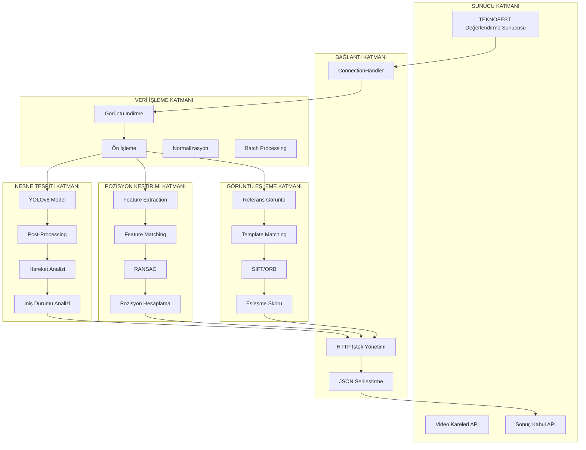

# TEKNOFEST 2026 - HAVACILIKTA YAPAY ZEKA YARIŞMASI
## SİSTEM MİMARİSİ VE ALGORİTMA ÖNERİLERİ

---

## 🏗️ GENEL SİSTEM MİMARİSİ

```
┌─────────────────────────────────────────────────────────────────────────────┐
│                          TEKNOFEST HAVACILIKTA YAPAY ZEKA SİSTEMİ           │
└─────────────────────────────────────────────────────────────────────────────┘

┌──────────────┐     ┌──────────────┐     ┌──────────────┐     ┌──────────────┐
│   SUNUCU     │────▶│  BAĞLANTI    │────▶│   VERİ       │────▶│   MODELLER   │
│   (TEKNOFEST)│     │   ARAYÜZÜ    │     │  İŞLEME      │     │  (AI/ML)     │
└──────────────┘     └──────────────┘     └──────────────┘     └──────────────┘
                           │
                           ▼
                    ┌──────────────┐
                    │   SONUÇLAR   │
                    │   (JSON)     │
                    └──────────────┘
```

---

## 📊 DETAYLI SİSTEM MİMARİSİ



---

## 🎯 ALGORİTMA ÖNERİLERİ - SIRALI PLANLAMA

### AŞAMA 1: VERİ İŞLEME ve ÖN HAZIRLIK (2 Hafta)

#### 1.1 Görüntü Ön İşleme Pipeline

```python
# Önerilen Kütüphaneler
import cv2
import numpy as np
from albumentations import Compose, Resize, Normalize, Blur

class ImagePreprocessor:
    def __init__(self):
        self.pipeline = Compose([
            Resize(640, 640),           # YOLO için standart boyut
            Normalize(mean=[0, 0, 0], std=[1, 1, 1]),
        ])
    
    def preprocess(self, image):
        # Gürültü giderme
        denoised = cv2.fastNlMeansDenoisingColored(image, None, 10, 10, 7, 21)
        
        # Kontrast iyileştirme
        lab = cv2.cvtColor(denoised, cv2.COLOR_BGR2LAB)
        l, a, b = cv2.split(lab)
        clahe = cv2.createCLAHE(clipLimit=3.0, tileGridSize=(8,8))
        cl = clahe.apply(l)
        enhanced = cv2.merge([cl, a, b])
        enhanced = cv2.cvtColor(enhanced, cv2.COLOR_LAB2BGR)
        
        # Pipeline uygula
        processed = self.pipeline(image=enhanced)['image']
        
        return processed
```

#### 1.2 Veri Artırma (Data Augmentation)

```python
from albumentations import (
    HorizontalFlip, VerticalFlip, Rotate, 
    RandomBrightnessContrast, GaussianBlur, 
    HueSaturationValue, CoarseDropout
)

augmentation_pipeline = Compose([
    HorizontalFlip(p=0.5),
    Rotate(limit=30, p=0.5),
    RandomBrightnessContrast(p=0.5),
    GaussianBlur(p=0.3),
    HueSaturationValue(p=0.3),
    CoarseDropout(max_holes=8, max_height=32, max_width=32, p=0.3),
])
```

---

### AŞAMA 2: NESNE TESPİTİ (4 Hafta) - %25 Puan

#### 2.1 Birincil Algoritma: YOLOv8

**Neden YOLOv8?**
- ✅ Hızlı (gerçek zamanlı çalışma)
- ✅ Yüksek doğruluk
- ✅ Transfer learning için uygun
- ✅ Aktif community desteği
- ✅ Python/PyTorch tabanlı

```python
from ultralytics import YOLO

# Model seçimi (performans dengesi)
model_variants = {
    'yolov8n': {'speed': '⚡⚡⚡⚡⚡', 'accuracy': '⭐⭐⭐', 'size': '6MB'},    # En hızlı
    'yolov8s': {'speed': '⚡⚡⚡⚡',   'accuracy': '⭐⭐⭐⭐',  'size': '23MB'},   # Dengeli
    'yolov8m': {'speed': '⚡⚡⚡',     'accuracy': '⭐⭐⭐⭐⭐', 'size': '52MB'},   # Önerilen ⭐
    'yolov8l': {'speed': '⚡⚡',       'accuracy': '⭐⭐⭐⭐⭐', 'size': '87MB'},   # Yüksek doğruluk
    'yolov8x': {'speed': '⚡',         'accuracy': '⭐⭐⭐⭐⭐', 'size': '137MB'}   # En doğruluk
}

# Öneri: YOLOv8m (hız-doğruluk dengesi için)
model = YOLO('yolov8m.pt')
```

#### 2.2 Eğitim Stratejisi

```python
# 3 Aşamalı Eğitim Planı

# AŞAMA 1: COCO Pre-trained Weights ile Fine-Tuning
model = YOLO('yolov8m.pt')  # COCO pre-trained

results = model.train(
    data='visdrone.yaml',      # VisDrone dataset
    epochs=50,
    imgsz=640,
    batch=16,
    lr0=0.01,                  # Initial learning rate
    lrf=0.01,                  # Final learning rate
    momentum=0.937,
    weight_decay=0.0005,
    warmup_epochs=3,
    patience=10,               # Early stopping
    save_period=5,
    device=0,                  # GPU
)

# AŞAMA 2: TEKNOFEST Öz Veri Seti ile Fine-Tuning
results = model.train(
    data='teknofest.yaml',
    epochs=100,
    imgsz=640,
    batch=8,
    lr0=0.001,                 # Daha düşük LR
    patience=15,
    augment=True,              # Data augmentation
    hsv_h=0.015,               # HSV hue augmentation
    hsv_s=0.7,                 # HSV saturation
    hsv_v=0.4,                 # HSV value
    degrees=15.0,              # Rotation
    translate=0.1,             # Translation
    scale=0.5,                 # Scale
    flipud=0.5,                # Vertical flip
    fliplr=0.5,                # Horizontal flip
    mosaic=1.0,                # Mosaic augmentation
    mixup=0.15,                # Mixup augmentation
)

# AŞAMA 3: Ensemble (Opsiyonel - 3-5% iyileştirme)
models = [
    YOLO('yolov8m_visdrone.pt'),
    YOLO('yolov8m_teknofest.pt'),
    YOLO('yolov8l_teknofest.pt')
]
# Test zamanı weighted averaging
```

#### 2.3 Hareket Durumu Tespiti Algoritması

```python
class MotionDetector:
    def __init__(self, buffer_size=5):
        self.buffer = []  # Son 5 kareyi tut
        self.buffer_size = buffer_size
    
    def detect_motion(self, frame_objects, frame_id):
        """Hareketli/Hareketsiz durumunu tespit et"""
        self.buffer.append((frame_id, frame_objects))
        if len(self.buffer) > self.buffer_size:
            self.buffer.pop(0)
        
        if len(self.buffer) < 2:
            return "Hareketsiz"  # Yetersiz veri
        
        # Nesne merkezlerini hesapla
        centers = []
        for fid, objects in self.buffer:
            for obj in objects:
                cx = (obj['x1'] + obj['x2']) / 2
                cy = (obj['y1'] + obj['y2']) / 2
                centers.append((cx, cy))
        
        # Hareket vektörünü hesapla
        if len(centers) >= 2:
            # İlk ve son kare arasındaki değişim
            dx = centers[-1][0] - centers[0][0]
            dy = centers[-1][1] - centers[0][1]
            distance = np.sqrt(dx**2 + dy**2)
            
            # Eşik değeri (piksel cinsinden)
            threshold = 20  # 20 piksel = hareketli
            
            if distance > threshold:
                return "Hareketli"
        
        return "Hareketsiz"
```

#### 2.4 İniş Durumu Analizi

```python
class LandingStatusAnalyzer:
    def __init__(self):
        pass
    
    def analyze_landing(self, uap_uai_object, all_objects):
        """UAP/UAİ alanının inişe uygunluğunu analiz et"""
        
        # Alanın koordinatları
        x1, y1, x2, y2 = uap_uai_object['bbox']
        
        # Alanın içinde başka nesne var mı?
        for obj in all_objects:
            if obj['class'] in ['UAP', 'UAI']:
                continue  # Kendini atla
            
            ox1, oy1, ox2, oy2 = obj['bbox']
            
            # Çakışma kontrolü (IoU)
            intersection_x1 = max(x1, ox1)
            intersection_y1 = max(y1, oy1)
            intersection_x2 = min(x2, ox2)
            intersection_y2 = min(y2, oy2)
            
            if intersection_x1 < intersection_x2 and intersection_y1 < intersection_y2:
                # Çakışma var - inişe uygun değil
                return "Uygun Değil"
        
        # Alanın tamamen görüntü içinde olup olmadığını kontrol et
        # (Görüntü kenarına çok yakınsa = uygun değil)
        img_h, img_w = 1080, 1920  # Örnek boyut
        margin = 50  # Piksel cinsinden
        
        if (x1 < margin or y1 < margin or 
            x2 > img_w - margin or y2 > img_h - margin):
            return "Uygun Değil"  # Alan tam görünmüyor
        
        return "Uygun"  # Temiz alan
```

---

### AŞAMA 3: POZİSYON KESTİRİMİ (3 Hafta) - %40 Puan

#### 3.1 Önerilen Algoritma: Hybrid Visual Odometry

**Neden Hybrid Yaklaşım?**
- Feature-based hızlı ama hassas
- Deep learning doğru ama yavaş
- Her ikisinin kombinasyonu optimal

```python
class HybridPositionEstimator:
    def __init__(self):
        # Feature-based için
        self.feature_detector = cv2.ORB_create(nfeatures=2000)
        self.matcher = cv2.BFMatcher(cv2.NORM_HAMMING, crossCheck=False)
        
        # Kalman Filter için
        from filterpy.kalman import KalmanFilter
        self.kf = KalmanFilter(dim_x=6, dim_z=3)
        self.kf.x = np.array([[0], [0], [0], [0], [0], [0]])  # [x,y,z,vx,vy,vz]
        self.kf.F = np.array([[1, 0, 0, 1, 0, 0],   # State transition
                              [0, 1, 0, 0, 1, 0],
                              [0, 0, 1, 0, 0, 1],
                              [0, 0, 0, 1, 0, 0],
                              [0, 0, 0, 0, 1, 0],
                              [0, 0, 0, 0, 0, 1]])
        self.kf.H = np.array([[1, 0, 0, 0, 0, 0],   # Measurement function
                              [0, 1, 0, 0, 0, 0],
                              [0, 0, 1, 0, 0, 0]])
        
        # Kamera parametreleri
        self.focal_length = 2792.2  # 2025 RGB kamera
        self.cx, self.cy = 1988.0, 1562.0
        
        # Önceki frame bilgisi
        self.prev_kp = None
        self.prev_desc = None
        self.prev_position = np.array([0.0, 0.0, 0.0])
    
    def estimate_position(self, image, health_status):
        """Pozisyon kestirimi yap"""
        
        if health_status == '1':
            # GPS çalışıyor - referans değer kullan
            return None  # main.py'de zaten handled
        
        # Feature extraction
        kp, desc = self.feature_detector.detectAndCompute(image, None)
        
        if self.prev_kp is None:
            self.prev_kp = kp
            self.prev_desc = desc
            return np.array([0.0, 0.0, 0.0])
        
        # Feature matching
        matches = self.matcher.knnMatch(self.prev_desc, desc, k=2)
        
        # Lowe's ratio test
        good_matches = []
        for m, n in matches:
            if m.distance < 0.7 * n.distance:
                good_matches.append(m)
        
        if len(good_matches) < 10:
            return self.prev_position  # Yetersiz match
        
        # RANSAC ile outlier removal
        src_pts = np.float32([self.prev_kp[m.queryIdx].pt for m in good_matches])
        dst_pts = np.float32([kp[m.trainIdx].pt for m in good_matches])
        
        M, mask = cv2.findHomography(src_pts, dst_pts, cv2.RANSAC, 5.0)
        
        # Translation hesapla (sadeştirilmiş)
        dx = M[0, 2]
        dy = M[1, 2]
        
        # Z ekseni için (basit yaklaşım)
        # Scale factor - kamera yüksekliğine göre
        scale = 0.1  # metre/piksel (ayarlanmalı)
        dz = 0  # Z değişimi genelde küçüktür
        
        # Kalman filter güncelleme
        self.kf.predict()
        self.kf.update(np.array([[dx], [dy], [dz]]))
        
        # Yeni pozisyon
        new_position = self.prev_position + self.kf.x[:3].flatten()
        
        # State güncelle
        self.prev_kp = kp
        self.prev_desc = desc
        self.prev_position = new_position
        
        return new_position
```

#### 3.2 Alternatif: Deep Learning Approach

```python
# Daha doğru ama daha yavaş ve GPU gerektirir
class DeepLearningPoseEstimator:
    def __init__(self):
        # Posenet veya FlowNet kullanabilir
        # Örnek: RAFT (Recurrent All-Pairs Field Transforms)
        pass
    
    def estimate(self, image_sequence):
        # Optical flow hesapla
        # Flow'dan translation çıkar
        pass
```

---

### AŞAMA 4: GÖRÜNTÜ EŞLEME (2 Hafta) - %25 Puan

#### 4.1 Önerilen Algoritma: Hybrid Template Matching

```python
class HybridImageMatcher:
    def __init__(self):
        self.sift = cv2.SIFT_create()
        self.orb = cv2.ORB_create()
        self.matcher = cv2.BFMatcher()
    
    def match_reference(self, reference_image, target_image):
        """Referans görüntüyü hedef görüntüde bul"""
        
        results = []
        
        # YÖNTEM 1: Template Matching (hızlı)
        template_results = self.template_matching(reference_image, target_image)
        results.append(('template', template_results))
        
        # YÖNTEM 2: SIFT (rotasyon/scale invariant)
        sift_results = self.sift_matching(reference_image, target_image)
        results.append(('sift', sift_results))
        
        # YÖNTEM 3: ORB (hızlı ve robust)
        orb_results = self.orb_matching(reference_image, target_image)
        results.append(('orb', orb_results))
        
        # Ensemble - sonuçları birleştir
        final_results = self.ensemble_results(results)
        
        return final_results
    
    def template_matching(self, ref, target):
        """OpenCV Template Matching"""
        result = cv2.matchTemplate(target, ref, cv2.TM_CCOEFF_NORMED)
        min_val, max_val, min_loc, max_loc = cv2.minMaxLoc(result)
        
        # Threshold ile filtrele
        threshold = 0.7
        if max_val >= threshold:
            h, w = ref.shape[:2]
            return {
                'bbox': (max_loc[0], max_loc[1], max_loc[0]+w, max_loc[1]+h),
                'confidence': max_val
            }
        return None
    
    def sift_matching(self, ref, target):
        """SIFT Feature Matching"""
        kp1, des1 = self.sift.detectAndCompute(ref, None)
        kp2, des2 = self.sift.detectAndCompute(target, None)
        
        matches = self.matcher.knnMatch(des1, des2, k=2)
        
        good = []
        for m, n in matches:
            if m.distance < 0.75 * n.distance:
                good.append(m)
        
        if len(good) > 10:
            src_pts = np.float32([kp1[m.queryIdx].pt for m in good]).reshape(-1, 1, 2)
            dst_pts = np.float32([kp2[m.trainIdx].pt for m in good]).reshape(-1, 1, 2)
            
            M, mask = cv2.findHomography(src_pts, dst_pts, cv2.RANSAC, 5.0)
            
            if M is not None:
                h, w = ref.shape[:2]
                pts = np.float32([[0, 0], [0, h-1], [w-1, h-1], [w-1, 0]]).reshape(-1, 1, 2)
                dst = cv2.perspectiveTransform(pts, M)
                
                return {
                    'bbox': cv2.boundingRect(dst),
                    'confidence': len(good) / len(matches)
                }
        return None
    
    def orb_matching(self, ref, target):
        """ORB Feature Matching"""
        kp1, des1 = self.orb.detectAndCompute(ref, None)
        kp2, des2 = self.orb.detectAndCompute(target, None)
        
        matches = self.matcher.knnMatch(des1, des2, k=2)
        
        good = []
        for m, n in matches:
            if m.distance < 0.75 * n.distance:
                good.append(m)
        
        # SIFT ile aynı mantık
        # ...
        return None
    
    def ensemble_results(self, results):
        """Birden fazla yöntemin sonucunu birleştir"""
        valid_results = [r for _, r in results if r is not None]
        
        if not valid_results:
            return None
        
        # Weighted average (confidence'a göre)
        total_conf = sum(r['confidence'] for r in valid_results)
        
        if total_conf == 0:
            return valid_results[0]
        
        # Bbox'ları birleştir (weighted average)
        weighted_bbox = np.zeros(4)
        for r in valid_results:
            weight = r['confidence'] / total_conf
            weighted_bbox += weight * np.array(r['bbox'])
        
        return {
            'bbox': tuple(weighted_bbox.astype(int)),
            'confidence': total_conf / len(valid_results)
        }
```

---

## 🔧 KULLANILACAK ARAÇLAR ve KÜTÜPHANELER

### Temel Kütüphaneler
```bash
# Temel
pip install numpy==1.24.3
pip install opencv-python==4.8.1.78
pip install pillow==10.0.0

# Deep Learning
pip install torch==2.0.1 torchvision==0.15.2
pip install ultralytics==8.0.196  # YOLOv8

# Görüntü İşleme
pip install albumentations==1.3.1
pip install imgaug==0.4.0

# Veri Bilimi
pip install pandas==2.0.3
pip install matplotlib==3.7.2
pip install scikit-learn==1.3.0

# Kalman Filter (opsiyonel)
pip install filterpy==1.4.5

# Progress bar
pip install tqdm==4.66.1
```

### Geliştirme Araçları
- **IDE:** VS Code / PyCharm
- **Jupyter Notebook:** Prototip için
- **TensorBoard:** Eğitim takibi
- **Weights & Biases:** Experiment tracking

---

## 📈 PERFORMANS OPTİMİZASYONU

### 1. Model Optimizasyonu

```python
# TensorRT ile hızlandırma (NVIDIA GPU için)
from ultralytics import YOLO
model = YOLO('yolov8m.pt')
model.export(format='engine')  # 2-3x hızlanma

# Quantization (hafifletme)
model.export(format='onnx', half=True)  # FP16
```

### 2. Batch Processing

```python
# Batch inference ile hızlandırma
def batch_process(images, model, batch_size=8):
    results = []
    for i in range(0, len(images), batch_size):
        batch = images[i:i+batch_size]
        batch_results = model(batch)
        results.extend(batch_results)
    return results
```

### 3. Multi-Threading

```python
from concurrent.futures import ThreadPoolExecutor

def parallel_process(images, model, max_workers=4):
    with ThreadPoolExecutor(max_workers=max_workers) as executor:
        results = list(executor.map(model, images))
    return results
```

---

## 📋 UYGULAMA SIRASI

### Hafta 1-2: Ortam Kurulumu ve Veri Hazırlığı
- [ ] Python ortamı kurulumu
- [ ] Gerekli kütüphanelerin yüklenmesi
- [ ] Veri setlerinin indirilmesi
- [ ] Veri setlerinin incelenmesi
- [ ] Etiket formatlarının anlaşılması

### Hafta 3-4: Temel Görüntü İşleme
- [ ] OpenCV temelleri
- [ ] Görüntü okuma/yazma
- [ ] Ön işleme pipeline
- [ ] Data augmentation

### Hafta 5-8: Nesne Tespiti (Görev 1)
- [ ] YOLOv8 kurulumu
- [ ] Pre-trained model testleri
- [ ] Custom data ile eğitim
- [ ] Hareket durumu algoritması
- [ ] İniş durumu analizi
- [ ] Test ve optimizasyon

### Hafta 9-11: Pozisyon Kestirimi (Görev 2)
- [ ] Feature extraction (ORB/SIFT)
- [ ] Feature matching
- [ ] Visual odometry
- [ ] Kalman filter entegrasyonu
- [ ] Test ve optimizasyon

### Hafta 12-13: Görüntü Eşleme (Görev 3)
- [ ] Template matching
- [ ] SIFT/ORB matching
- [ ] Ensemble yöntemleri
- [ ] Test ve optimizasyon

### Hafta 14-15: Sistem Entegrasyonu
- [ ] Tüm modüllerin birleştirilmesi
- [ ] Bağlantı arayüzü entegrasyonu
- [ ] End-to-end testing
- [ ] Performance tuning

### Hafta 16: Final Test ve Rapor
- [ ] Simülasyon testleri
- [ ] Bug fixing
- [ ] Ön Tasarım Raporu yazımı
- [ ] Sunum hazırlığı

---

## 🎓 ÖĞRENME KAYNAKLARI

### Online Kurslar
- Coursera: "Deep Learning Specialization" (Andrew Ng)
- Udacity: "Computer Vision Nanodegree"
- Fast.ai: "Practical Deep Learning for Coders"

### Dokümantasyon
- PyTorch: https://pytorch.org/docs/
- OpenCV: https://docs.opencv.org/
- YOLOv8: https://docs.ultralytics.com/

### GitHub Repos
- Ultralytics YOLOv8: https://github.com/ultralytics/ultralytics
- OpenCV: https://github.com/opencv/opencv

---

**Son Güncelleme:** 20 Nisan 2026

*Bu sistem mimarisi TEKNOFEST 2026 Havacılıkta Yapay Zeka Yarışması için optimize edilmiştir.*
